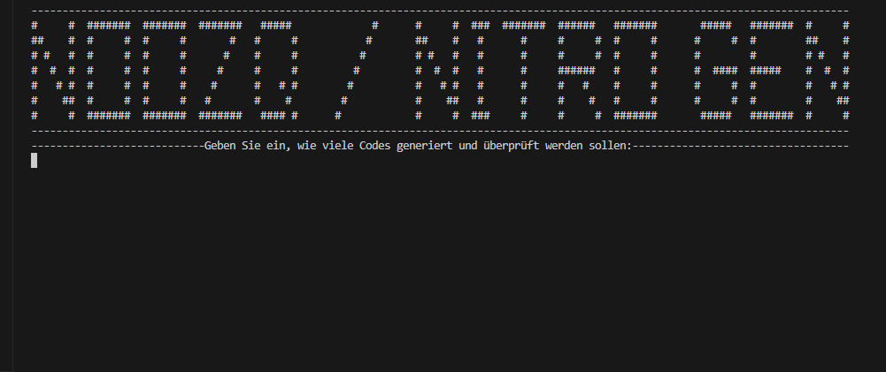

<h1 align='center'>NOOZQ

</h1>
<h3 align='center'>
DISCORD NITRO GENERATOR
</h3>


<h3 align="center">

<h3>

<h3 align="center">
   <a href="" alt="Stars"></a>
   <a href="https://github.com/VintellX/Discord-Nitro/network/members"></a><br>
</h3><br>

<h1 align='center'>🛠️ SPRACHE UND TOOLS</h1>
<h3>

</h3>

<h3 align='center'>
  
  
</h3>  


<h1 align='center'>📥 DOWNLOAD</h1>
<h3 align='center'>1. Lade Sie Die BOOST-GEN als zip herunter.</h3>
<h3 align='center'>2. Enpacken Sie Die zip datei.</h3>

* Extensions Installieren:
```
pip install -r requirements.txt
```

* Run datei:
```
start nitrogen.py
```

<h1 align='center'>🔮 UPDATES / LOGS</h1>
